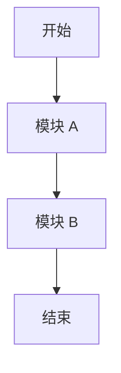
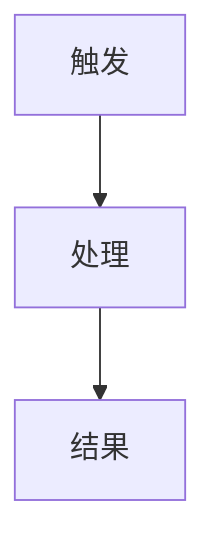

# Large Requirement Markdown Template

```markdown
# <需求名称>

## 1. 需求概览

### 1.1 背景
- 业务背景：
- 当前问题：
- 触发原因：

### 1.2 目标
- 目标 1：
- 目标 2：
- 成功标准：

### 1.3 角色与干系人
| 角色/系统 | 职责 | 关注点 |
| --- | --- | --- |
|  |  |  |

## 2. 范围说明

### 2.1 本次包含范围
- 

### 2.2 本次不包含范围
- 

### 2.3 依赖与约束
- 上游依赖：
- 下游依赖：
- 技术/业务约束：

## 3. 模块总览

| 模块 | 模块目标 | 优先级 | 依赖 | 主要风险 |
| --- | --- | --- | --- | --- |
|  |  |  |  |  |

## 4. 总体流程



## 5. 模块详细说明

### 5.1 <模块名称>

#### 5.1.1 模块目标
- 

#### 5.1.2 适用角色与前置条件
- 角色：
- 前置条件：
- 触发条件：

#### 5.1.3 业务流程



#### 5.1.4 功能点清单
| 功能点 | 目标 | 要做什么 | 关键规则 | 异常/问题 | 注意点 |
| --- | --- | --- | --- | --- | --- |
|  |  |  |  |  |  |

#### 5.1.5 数据与系统影响
- 涉及页面/接口：
- 涉及数据对象/表：
- 涉及外部系统：
- 对其他模块影响：

#### 5.1.6 待确认项
- 

#### 5.1.7 实现与测试注意点
- 实现注意点：
- 联调注意点：
- 测试注意点：

### 5.2 <模块名称>

重复 5.1 结构

## 6. 跨模块问题

| 问题/风险 | 影响模块 | 影响说明 | 建议处理方式 |
| --- | --- | --- | --- |
|  |  |  |  |

## 7. 风险与待确认项

### 7.1 已识别风险
- 

### 7.2 待确认项
- 

## 8. 实施建议

### 8.1 推荐优先级
1. 
2. 
3. 

### 8.2 阶段划分建议
- Phase 1：
- Phase 2：
- Phase 3：

## 9. 验收建议

| 验收项 | 验收标准 |
| --- | --- |
|  |  |
```
